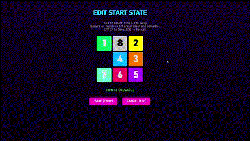
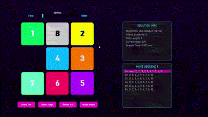
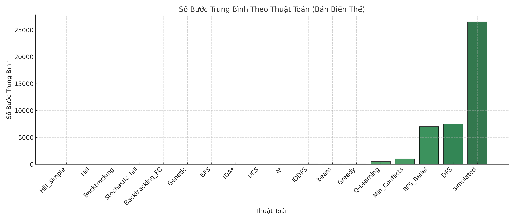

# 🧩 Visual 8-Puzzle Solver: Tận Mắt Chứng Kiến Thuật Toán Tìm Kiếm Hoạt Động!

Chào mừng bạn đến với dự án **Visual 8-Puzzle Solver**, một công cụ tương tác được xây dựng với Pygame, cho phép bạn không chỉ giải bài toán 8-Puzzle kinh điển mà còn **trực quan hóa sâu sắc cách các thuật toán tìm kiếm hoạt động**. Dự án này là "phòng thí nghiệm" hoàn hảo để bạn khám phá thế giới thuật toán một cách sinh động và dễ hiểu nhất!

## ✨ Tại Sao Bạn Cần Dự Án Này?

Bạn đã bao giờ tự hỏi các thuật toán BFS, A*, hay Hill Climbing "suy nghĩ" như thế nào khi tìm đường? Dự án này trả lời câu hỏi đó bằng cách:

*   **Biến thuật toán thành hình ảnh:** Theo dõi từng bước di chuyển của ô trống, từng trạng thái được khám phá.
*   **Cung cấp bộ sưu tập đa dạng:** Học và so sánh hiệu quả của nhiều phương pháp tìm kiếm khác nhau trên cùng một bài toán.
*   **Giới thiệu các khái niệm nâng cao:** Trải nghiệm các tính năng độc đáo mô phỏng các kỹ thuật phức tạp như And-Or Trees (qua "Di Chuyển Kép"), Belief State Search (qua "Tìm Kiếm Mù"), và CSP Backtracking (qua "Hoạt Ảnh Điền Số").

## 🎬 Các Điểm Nổi Bật (Xem Demo!)

*Minh họa giao diện menu.*
Dự án mang đến nhiều tính năng độc đáo không chỉ giúp giải đố mà còn là công cụ học tập tuyệt vời.

### Di Chuyển Kép: Mở Rộng Không Gian Hành Động (Ứng dụng And-Or Tree) 🔄

Xem cách các thuật toán xử lý khi ô trống có thể thực hiện **một hoặc hai bước di chuyển hợp lệ** trong một lượt. Đây là một minh họa thú vị về việc biểu diễn các "hành động phức hợp" (composite actions) dựa trên các hành động cơ bản, gợi nhớ đến cấu trúc And-Or trong lập kế hoạch.


*Minh họa tìm kiếm với hành động di chuyển kép.*

### Tìm Kiếm Mù: Hoạt Động Dưới Sự Không Chắc Chắn (Blind Belief Search) 🙈

Điều gì xảy ra khi agent không biết chính xác trạng thái hiện tại của puzzle? Tính năng **Blind Belief Search** mô phỏng điều này bằng cách duy trì một "tập hợp các trạng thái khả dĩ" (belief state) và tìm kiếm một chuỗi hành động chung có thể giải quyết tất cả các trạng thái trong tập hợp đó cùng lúc.

### Hoạt Ảnh Điền Số: Trực Quan Hóa Backtracking (CSP) 🔢➡️✅

Xem thuật toán **Backtracking** "vật lộn" để đặt các số từ 1 đến 8 vào lưới (ô 9 là ô trống) sao cho khớp với trạng thái đích mong muốn. Bạn sẽ thấy rõ quá trình thử (exploration) và lùi lại (backtracking) khi thuật toán gặp bế tắc hoặc vi phạm ràng buộc.


*Mô phỏng từng bước thử và lùi của Backtracking.*

### Tùy Chỉnh Trạng Thái Ban Đầu ✍️

Thiết kế bài toán của riêng bạn! Dễ dàng thay đổi vị trí các ô số để kiểm tra thuật toán trên các cấu hình khác nhau.



### Giao Diện Trực Quan & Điều Khiển Hoạt Ảnh 🖱️

Giao diện chính thân thiện giúp bạn dễ dàng chọn thuật toán và tính năng. Khi giải đố, bạn có thể chạy tự động, xem từng bước, làm lại, và điều chỉnh tốc độ hoạt ảnh để theo dõi chi tiết quá trình giải.


## 🔬 Thư Viện Thuật Toán Đa Dạng

Dự án triển khai một loạt các thuật toán tìm kiếm phổ biến trong AI, được phân loại rõ ràng để bạn dễ dàng khám phá. Hầu hết các thuật toán cũng có phiên bản hỗ trợ "Di Chuyển Kép" (_ANDOR).

### Tìm Kiếm Không Thông Tin (Uninformed Search)
*   Breadth-First Search (BFS) & BFS (Double Moves)
*   Depth-First Search (DFS) & DFS (Double Moves)
*   Iterative Deepening DFS (IDDFS) & IDDFS (Double Moves)
*   Uniform-Cost Search (UCS) & UCS (Double Moves)

### Tìm Kiếm Có Thông Tin (Informed/Heuristic Search)
*   Greedy Best-First Search & Greedy Search (Double Moves)
*   A\* Search (Manhattan Heuristic) & A\* Search (Double Moves)
*   Iterative Deepening A\* (IDA\*) & IDA\* (Double Moves)

### Tìm Kiếm Cục Bộ (Local Search)
*   Simple Hill Climbing & Simple Hill Climbing (Double Moves)
*   Steepest Ascent Hill Climbing & Steepest Ascent Hill Climbing (Double Moves)
*   Stochastic Hill Climbing & Stochastic Hill Climbing (Double Moves)
*   Beam Search & Beam Search (Double Moves)
*   Simulated Annealing & Simulated Annealing (Double Moves)

### Các Kỹ Thuật Khác
*   Backtracking Search (sử dụng trong Hoạt Ảnh Điền Số)
*   Searching with No Observation (Blind Belief Search)
*   Q-Learning (Học Tăng Cường - cần huấn luyện)

## 🛠️ Cài Đặt và Chạy

Bạn chỉ cần Python 3.7+ và thư viện Pygame.

1.  **Clone dự án:**
    ```bash
    git clone https://github.com/Huyaccount/FAST_8_PUZZLE_SOLVER.git
    cd FAST_8_PUZZLE_SOLVER
    ```

2.  **Cài đặt Pygame:**
    ```bash
    pip install pygame
    ```

3.  **Chạy ứng dụng:**
    ```bash
    python main.py
    ```

## 📂 Cấu Trúc Dự Án

*   `algorithms/`: Mã nguồn các thuật toán tìm kiếm.
*   `assets/`: Các file demo GIF.
*   `blind.py`: Logic cho tính năng Blind Belief Search.
*   `fill.py`: Logic cho Hoạt Ảnh Điền Số bằng Backtracking.
*   `main.py`: Điểm khởi đầu và giao diện chính của ứng dụng.
*   `README.md`: File README này.
*   `.gitignore`: Danh sách các file bị bỏ qua bởi Git.

## ✍️ Compare

## 👨‍💻 Tác Giả

Dự án được phát triển bởi **Nguyễn Lâm Huy**.
*   Email: lamhuy5a5@gmail.com
*   GitHub: https://github.com/Huyaccount/FAST_8_PUZZLE_SOLVER
*   Link dự án: None

Hy vọng công cụ này sẽ giúp việc học và khám phá thuật toán tìm kiếm của bạn trở nên thú vị và hiệu quả hơn! Chúc bạn có những trải nghiệm tuyệt vời!
